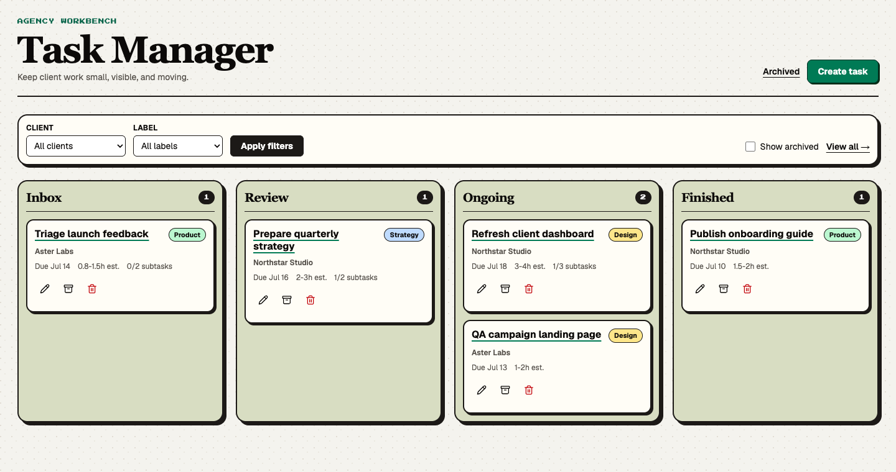
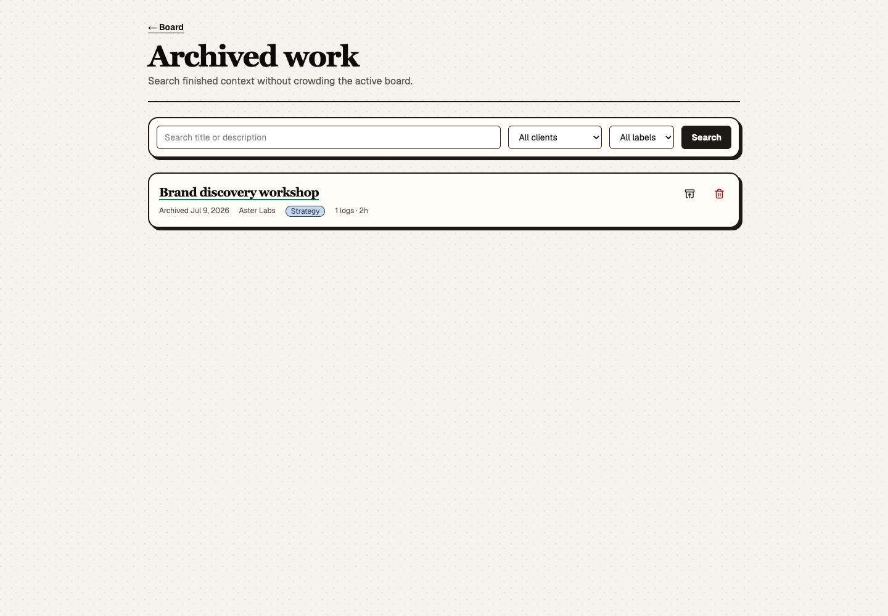
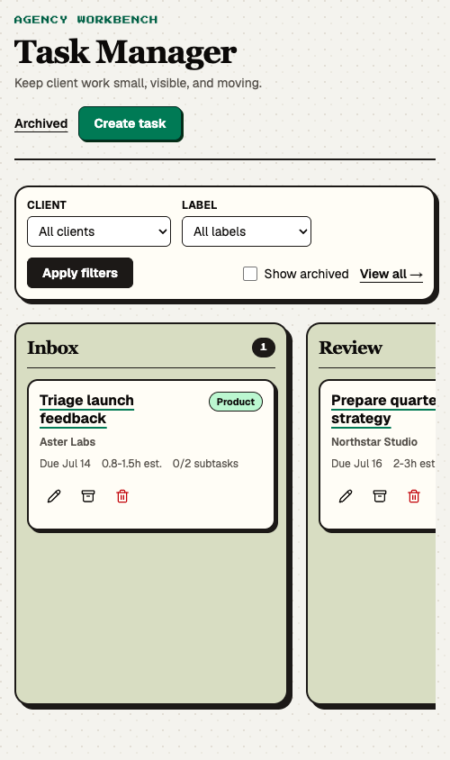

# Task Manager

A small, focused task manager for keeping client work visible and moving.



## Features

- Work as an organization: invite teammates and share one board
- Delegate a task to a teammate and see it accepted on their board
- Collaborate on shared tasks with per-author attribution
- Move tasks between Inbox, Review, Ongoing, and Finished with a status menu
- Organize work by client and label
- Track task estimates, subtask estimates, and logged time in decimal hours
- Keep completed subtasks separate from detailed manual work logs
- Compare estimates with logged hours and attach supporting images
- Search, restore, or permanently delete archived tasks
- Sync task deadlines to your own Google Calendar as all-day events
- Manage daily task work from the terminal with the `task` CLI
- Keyboard, touch, mobile, and reduced-motion support

## Teams and delegation

The task manager is organization-based and multi-user. Sign-in is by password
or magic link, and new accounts are invite-only: an owner or admin invites
teammates by email from **Settings > Members**, and each invitee joins through
their invitation link.

Task visibility follows your role. Owners and admins see every task in the
organization; members see only the tasks they created or are a participant of.

Assigning a task to a teammate delegates it: the task appears on their board
with a "From ..." marker and an **Accept** button, and stays pending until they
accept. Assigning only someone else hands the task off without co-assigning you,
so your own board stays focused; leave the picker empty to keep a task as yours.
The participant picker appears once your organization has more than one member.

Everyone who participates in a task shares its detail view, seeing all subtasks
and work logs with each author's avatar. Owners and admins also get board scope
filters - **Everyone**, **Mine**, and **Delegated by me** - to narrow what the
board shows.

From **Settings > Tokens** each person can copy a personal calendar feed to
subscribe to their tasks and mint an API token for programmatic access,
including the terminal client below and the [MCP toolbox](MCP.md) that lets an
AI assistant manage tasks on their behalf. From **Settings > Integrations**
each person can connect their own Google Calendar, which syncs the deadlines of
tasks they participate in as all-day events; see
[GOOGLE_CALENDAR.md](GOOGLE_CALENDAR.md) for setup.

## Terminal client

The always-online `task` CLI uses the hosted app's MCP endpoint, so it has no
local task database, cache, or offline mode. It requires Node.js 26 and runs its
TypeScript source directly without a build step. Install it from this checkout:

```bash
pnpm install
cd cli
pnpm link --global
```

Mint a personal API token under **Settings > Tokens**, then authenticate with
the hosted app's base URL:

```bash
task auth https://tasks.example.com YOUR_API_TOKEN
task list
task show 42
task move 42 Ongoing
```

`task auth` verifies the credentials before saving them to an owner-only config
file. For scripts and CI, set both `TASK_URL` and `TASK_TOKEN` to override the
saved credentials. Read commands use human-readable output by default and
accept `--json`; run `task --help` for the supported daily-driver commands and
flags. Administration, destructive actions, work-log images, and calendar
integration remain in the web app.

## Task details

Each task has its own workspace with detailed, sortable active subtasks and a
separate completed-subtask section. Subtasks can keep their own description and
up to ten reference links alongside their status and estimate. Work logs are
manual records with a required short summary and hours spent, optional detailed
notes, and up to five PNG, JPEG, GIF, or WebP images. Images are limited to 5 MB
each, 15 MB total, 8192 pixels per side, and 20 megapixels. Deleting a work log
permanently removes its images.

Completing a subtask offers a pre-filled work log: the subtask's estimate is
carried over, you add the hours it actually took (or skip). Manual work logs
can also record an estimate, shown as N/A when absent, and each entry displays
its over/under variance. The task header includes a per-worklog breakdown of
estimates versus actuals.

The task header compares total logged hours with the task's estimate range.
Top-level task estimates can cover large projects; individual subtask estimates
use 15-minute increments and are capped at 5 hours.

## Archive



## Mobile



## Run locally

```bash
pnpm install
cp .env.example .env
./start-database.sh
pnpm exec prisma migrate deploy
pnpm dev
```

Open [http://localhost:3000](http://localhost:3000).

`prisma migrate deploy` preserves existing minute-based estimates and work-log
durations while backfilling their decimal-hour replacements.

## End-to-end tests

With the local PostgreSQL container running:

```bash
pnpm exec playwright install chromium
pnpm test:e2e
```

The Playwright suite uses a separate `task_manager_e2e` PostgreSQL schema. It
resets only that schema, starts the app on port 3100 with test-only credentials,
performs real pointer input, and verifies the result after a page reload.

## Stack

Next.js, React, TypeScript, Tailwind CSS, Prisma, PostgreSQL, Better Auth,
dnd-kit, and Sharp.
