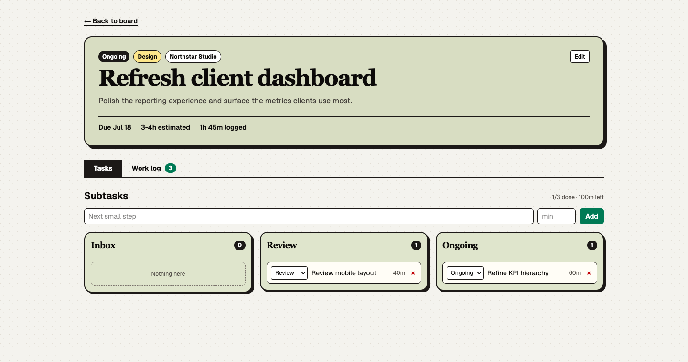

# Task Manager

A small, focused task manager for keeping client work visible and moving.


## Features

- Drag tasks between Inbox, Review, Ongoing, and Finished
- Organize work by client and label
- Track deadlines, estimates, subtasks, and work logs
- Search, restore, or permanently delete archived tasks
- Keyboard, touch, mobile, and reduced-motion support

## Task details

Each task has its own workspace with sortable subtasks and a combined activity log.



## Archive


## Mobile


## Run locally

```bash
pnpm install
cp .env.example .env
./start-database.sh
pnpm exec prisma migrate deploy
pnpm dev
```

Open [http://localhost:3000](http://localhost:3000).

## Stack

Next.js, React, TypeScript, Tailwind CSS, Prisma, PostgreSQL, and dnd-kit.
